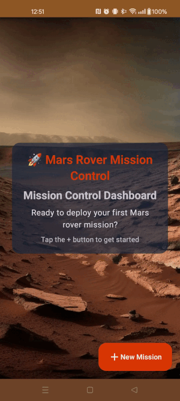

# Mars Rover Challenge - Multi-Module Android Implementation

[](https://github.com/mustalk/MarsRover/actions/workflows/android-ci-cd.yml)

This repository presents a solution to the Mars Rover coding challenge, initially implemented as a single `:app` module, and showcasing a complete, progressive migration to a production-ready, multi-module architecture.

While the app fulfills the [challenge requirements](CHALLENGE.md), calculating a rover's final position from a given set of instructions, its primary purpose is to serve as a comprehensive case study in Android architecture.
It documents a complete, step-by-step progressive migration from a monolithic single-module app to a scalable, multi-module setup using convention plugins and clean architecture principles,
all while maintaining full application functionality throughout the process, simulating a real-world refactoring of a legacy application without disrupting users.

### App Demo

<div align="center">
  
</div>
<br/>
<div align="center">

**[⬇️ Download Latest Debug APK](https://github.com/mustalk/MarsRover/releases/latest/download/mustalk-mars-rover-debug.apk)**

<small><em>Note: This is a debug build. You may need to enable "Install from unknown sources" on your device.</em></small>

</div>

---

## How to Launch and Build the Multi-Module Project

### Prerequisites

* **Android Studio:** Android Studio Meerkat | 2024.3.2 or later is recommended.
    * *Android Studio Ladybug | 2024.2.2 Patch 1 have some AGP compatibility issues (e.g., "AGP 8.10.0 is incompatible, latest
      supported is AGP 8.8.1"). Upgrading to a newer Android Studio version (like Meerkat 2024.3.2) resolved these compilation problems.*
* **Android Gradle Plugin (AGP):** The project uses AGP version 8.10.0 with advanced convention plugins (as defined in `libs.versions.toml`). Ensure
  your Android Studio version supports this AGP version (
  see [Android Studio & AGP compatibility](https://developer.android.com/studio/releases#android_gradle_plugin_and_android_studio_compatibility)).
* **Java Development Kit (JDK):** JDK 17.
* **Android SDK:** Compile SDK API level 35, though the app targets `minSdk = 24`.
* **Emulator/Device:** An Android Emulator or a physical Android device (API 24+).

### Steps to Build and Run

1. **Clone the repository:**
   ```bash
   git clone https://github.com/mustalk/MarsRover.git
   cd MarsRover
   ```
2. **Open in Android Studio:**
    * Launch Android Studio.
    * Select "Open an existing Android Studio project".
    * Navigate to the cloned `MarsRover` directory and open it.
    * Android Studio will automatically detect the multi-module structure.
3. **Sync Gradle:**
    * Android Studio should automatically sync the multi-module project. If not, click "Sync Project with Gradle Files" (elephant icon in the
      toolbar).
    * The convention plugins will be automatically applied.
4. **Build the Multi-Module Project:**
    * From the menu, select `Build` > `Assemble Project` (or Ctrl+F9 / Cmd+F9).
    * Alternatively, to build all modules from the command line:
      ```bash
      ./gradlew assembleDebug
      ```
5. **Run the Application:**
    * Select an emulator or connect a physical device.
    * Click the "Run 'app'" button (green play icon) in Android Studio or select `Run` > `Run 'app'` (Shift+F10).
    * The app assembles all feature and core modules automatically.

## Architectural Decisions & Design Choices (Multi-Module)

This multi-module implementation showcases production-ready Android development practices, focusing on a scalable, maintainable, and testable codebase
suitable for enterprise applications.

### Modularization Strategy: Hybrid Multi-Layered

The architecture combines **feature-based** and **layer-based** modularization:

```
:app                    # Application entry point, navigation, DI coordination
├── :feature:dashboard  # Dashboard feature with mission results display
├── :feature:mission    # New Mission feature with JSON/Builder input modes
└── :core:*             # Shared infrastructure layers
    ├── :core:model           # Domain entities (pure Kotlin)
    ├── :core:common          # Shared utilities (pure Kotlin)
    ├── :core:domain          # Business logic interfaces (pure Kotlin)
    ├── :core:data            # Data implementations (Android)
    ├── :core:ui              # Shared UI components (Android)
    ├── :core:testing-jvm     # JVM testing utilities
    └── :core:testing-android # Android testing utilities
```

> **💡 Alternative Strategies**: For projects with extensive parallel development across large teams, a **purely feature-based** approach with minimal
> shared core modules might be preferred. This allows maximum team independence with each feature owning its complete vertical slice (UI, domain, data),
> trading some code reuse for development velocity and reduced integration conflicts. The hybrid approach chosen here balances code reuse with team
> scalability for medium to large projects.

### Dependency Flow

```
:app ──────────────────────────────┐
├── :feature:dashboard             │
├── :feature:mission               │
│                                  ▼
├── :core:ui ──────────────────┐   │
├── :core:data ────────────┐   │   │
│   │                      ▼   ▼   ▼
├── :core:domain ──────┐   └─→ Hilt DI
│   │                  ▼
├── :core:common ──┐   │
│   │              ▼   ▼
└── :core:model ◄──┴───┘

:app → :feature:* → :core:ui → :core:data → :core:domain → :core:model
                                     ↓
                              :core:common
```

- **Clean Architecture compliance** with inward-flowing dependencies and clear architectural boundaries
- **Platform independence** for domain and common modules (pure Kotlin)

* **Architecture:** MVVM (Model-View-ViewModel) pattern is used for the presentation layer, with ViewModels in feature modules and domain logic in
  core modules.
    * **View (Compose UI):** Jetpack Compose is used for building the user interface declaratively across feature modules.
    * **ViewModel:** Manages UI-related state using Kotlin Coroutines and StateFlow, handles user events, and delegates business logic to UseCases
      from core modules.
    * **Model (Domain + Data):**
        * **UseCases (Core Domain Layer):** Encapsulate specific business logic operations (e.g., `ExecuteRoverMissionUseCase`,
          `ExecuteNetworkMissionUseCase`) in `:core:domain` module as pure Kotlin.
        * **Repositories (Core Data Layer):** Abstract data sources in `:core:domain`, with implementations in `:core:data`. Data sources include
          local JSON processing and a simulated network API.
        * **Data Models:** Domain entities in `:core:model` (`Plateau`, `Position`, `Direction`, `Rover`, `RoverMissionInstructions`) and DTOs in
          `:core:data` for data transfer (`MarsRoverInput`, `MissionResponse`).
* **Clean Architecture Principles:** The multi-module structure follows principles of Clean Architecture, with clear separation of concerns between
  layers and modules (presentation, domain, data). This promotes modularity, testability, and independent feature development.
* **SOLID Principles:** Applied throughout the multi-module codebase to ensure maintainability and flexibility.
* **Dependency Injection:** Hilt is used across all modules for managing dependencies, with module-specific DI configurations and cross-module
  injection capabilities.
* **Kotlin Coroutines & Flows:** Asynchronous operations are handled using Kotlin Coroutines across modules, with StateFlow for reactive UI state
  updates in feature modules.
* **Functional Programming Patterns:** Enhanced with sealed classes like `NetworkResult` in `:core:common` for representing state, providing robust
  error handling and code expressiveness across the entire multi-module architecture.
* **Modularization:** The codebase is fully modularized with 10 modules, each having single responsibilities and clear boundaries, supporting
  independent development and scalable team workflows.
* **Immutability:** Favoring immutable data structures (`val`, `data class`) across all modules, especially for UI state and domain models.

## Convention Plugins Infrastructure

### Build Logic Setup

Following Android best practices, a mature `build-logic/` infrastructure was established for centralized module configuration, main convention plugins:
```
build-logic/
├── convention/
│   ├── src/main/kotlin/
│   │   ├── AndroidApplicationConventionPlugin.kt
│   │   ├── AndroidLibraryConventionPlugin.kt
│   │   ├── JvmLibraryConventionPlugin.kt
│   │   ├── AndroidFeatureConventionPlugin.kt
│   │   ├── AndroidHiltConventionPlugin.kt
│   │   ├── RootTestingConventionPlugin.kt
│   │   └── ProjectUtilsConventionPlugin.kt
│   └── build.gradle.kts
└── gradle.properties
```

> **📖 For detailed build-logic documentation**: See [build-logic/README.md](build-logic/README.md) for advanced configuration options, reusability
> guide for new projects, and production-ready development infrastructure setup.

### Key Convention Plugins

- **`marsrover.android.application`**: App module configuration with Compose and production settings
- **`marsrover.android.feature`**: Feature module standardization with Compose, Hilt, navigation dependencies
- **`marsrover.android.library`**: Core Android modules with consistent configuration
- **`marsrover.jvm.library`**: Pure Kotlin/JVM modules for domain logic
- **`marsrover.root.testing`**: Multi-module testing orchestration with enhanced reporting

## Migration Phases

The migration was executed progressively over 8 main phases while maintaining the application fully functional:

1. **Build Logic & Version Catalog**: Established convention plugins and centralized dependency management
2. **Core Model Layer**: Extracted pure domain models to `:core:model`
3. **Core Domain & Data Layers**: Separated business logic interfaces and data implementations to `:core:domain` and `:core:data`
4. **Core Common Utilities**: Extracted shared utilities and functional programming components
5. **Core UI & Theme System**: Moved shared UI components and established multi-module resource management
6. **Core Testing Infrastructure**: Created dual JVM/Android testing architecture with structured test data
7. **Feature Module Extraction**: Migrated Dashboard and Mission features to dedicated modules
8. **Advanced Testing & Coverage**: Implemented three-tier Jacoco coverage system with dynamic module detection

Each phase maintained application functionality while incrementally improving the architectural foundation. The complete commit history provides
detailed insights into the step-by-step transformation process.

### Multi-Module Resource Management

**Implementation**:

- **Naming conventions**: `core_ui_*`, `feature_dashboard_*`, `feature_mission_*` for organized resource management
- **StringResourceProvider**: Centralized resource access for ViewModels across modules
- **Resource IDs approach**: Using `@StringRes Int?` for validation errors with proper localization
- **Parameterized resources**: Dynamic content with placeholder support for internationalization

## App Key Features

* **Rover Simulation Logic:** Core domain logic in `:core:domain` with pure Kotlin implementation to parse instructions (`L`, `R`, `M`), turn the
  rover, move it on a plateau, and handle boundary conditions.
* **Dual Input Modes in Mission Feature Module:**
    * **JSON Input:** Allows users to provide mission parameters as a raw JSON string.
    * **Builder Mode:** A user-friendly form to input plateau dimensions, rover start position/direction, and movement commands field by field.
* **API Simulation (For demo purposes) & Functional Error Handling:**
    * The "Builder" mode simulates network API calls for mission execution using components from `:core:data`.
    * This is achieved using OkHttp and Retrofit with a custom `Interceptor` (`MissionSimulationInterceptor`) in `:core:data`. This interceptor reuses
      the core domain logic by invoking the `ExecuteRoverMissionUseCase` from `:core:domain`. This ensures data processing consistency whether the
      mission originates from a local JSON or a simulated network request, avoiding duplication of business logic across modules.
    * The simulation includes realistic network delays and response structures (success/error).
    * **Functional Programming for Network Results:** Network call outcomes are wrapped in a `NetworkResult<T>` sealed class in `:core:common`. This
      monad-like structure provides a robust and functional way to handle success, error, and loading states across all modules, improving the clarity
      and reliability of asynchronous operations and error propagation.
* **Multi-Module User Interface (Jetpack Compose):**
    * **Dashboard Screen:** In `:feature:dashboard`, displays results of previous missions and allows navigation to create new missions.
    * **New Mission Screen:** In `:feature:mission`, provides JSON and Builder input modes.
    * **Shared Design System:** Custom Mars-themed design (light and dark modes) with reusable UI components in `:core:ui`.
    * **Animations:** Lottie animations for loading states and slide animations for screen transitions.
* **Error Handling:** Multi-module error handling for invalid inputs, JSON parsing errors, and (simulated) network issues, with user-friendly toast
  messages and centralized error management.
* **State Management:** UI state managed in feature module ViewModels using `StateFlow`, collected reactively by Composable screens with cross-module
  state coordination.

## Testing Strategy

The project emphasizes on a robust testing strategy covering **200+ total tests** with advanced testing capabilities and structured test infrastructure:

### Structured Test Data Pattern

**Implementation**: Centralized test data objects with paired inputs and expected results:

```kotlin
object DomainTestData {
    object UseCaseTestData {
        object SuccessfulExecution {
            object StandardMission {
                const val JSON = """{"topRightCorner":{"x":5,"y":5},"roverPosition":{"x":1,"y":2},"roverDirection":"N","movements":"LMLMLMLMM"}"""
                val EXPECTED_RESULT = MissionResult(finalPosition = "1 3 N")
            }
        }
    }
}
```

**Benefits**: Eliminates hardcoded test values, ensures consistency across modules, and improves test maintainability.

* **Unit Tests:**
    * Distributed across all modules in their respective `src/test/kotlin` directories.
    * Cover domain logic (UseCases, services, validators, parsers) in `:core:domain`, ViewModels in feature modules, and utility classes like
      `NetworkResult` in `:core:common`.
    * MockK for mocking dependencies across modules.
    * JUnit and Truth for assertions with structured test data from `:core:testing-jvm`.
* **UI Tests (Jetpack Compose):**
    * Located in `src/androidTest/kotlin` directories across feature and core UI modules.
    * Test Composable screens in feature modules, individual UI components in `:core:ui`, and navigation flows.
    * Cross-module navigation testing and screen interactions.
* **Dual Testing Architecture:**
    * **`:core:testing-jvm`**: Pure Kotlin/JVM testing utilities for domain layer testing.
    * **`:core:testing-android`**: Android-specific testing utilities with Hilt integration.
    * **MarsTestRunner**: Custom Hilt test runner with `HiltTestApplication` for dependency injection in UI tests across all modules.

### Test Coverage with Jacoco

The project includes advanced multi-module test coverage reporting using Jacoco with three-tier reporting system:

#### Generate Coverage Reports

```bash
# Generate overall coverage report (combines all modules)
./gradlew jacocoOverallAggregatedReport

# Generate JVM-only coverage (domain logic)
./gradlew jacocoJvmAggregatedReport

# Generate Android-only coverage (UI and app logic)
./gradlew jacocoAndroidAggregatedReport

# Generate coverage from existing test data (CI optimized)
./gradlew generateOverallCoverageReport

# Multi-module testing commands
./gradlew testAllModules --parallel                  # Unit tests across all modules
./gradlew testCompleteSuite --parallel               # Unit + UI tests
./gradlew testAllWithCoverage --parallel             # Unit tests + coverage
./gradlew testCompleteSuiteWithCoverage --parallel   # Complete suite + coverage
```

#### View Coverage Reports

- **Overall Coverage HTML**: `build/reports/jacoco/overall-aggregate/html/index.html`
- **Overall Coverage XML**: `build/reports/jacoco/overall-aggregate/jacocoOverallAggregatedReport.xml`
- **JVM Coverage HTML**: `build/reports/jacoco/jvm-aggregate/html/index.html`
- **Android Coverage HTML**: `build/reports/jacoco/android-aggregate/html/index.html`

#### Coverage Features

- ✅ **Three-tier reporting** - JVM, Android, and Overall coverage across all modules
- ✅ **Smart module filtering** - Only includes modules with relevant test sources
- ✅ **Dynamic module detection** - Adapts to project structure changes automatically
- ✅ **Multi-module coverage** across all `:core` and `:feature` modules
- ✅ **Excludes generated code** (Hilt, Compose, Android framework)
- ✅ **CI/CD integration** with memory-optimized step separation
- ✅ **Configuration cache compatible** for faster builds
- ✅ **SonarQube ready** - XML reports compatible with external tools
- ✅ **Professional reporting** with module categorization and clickable reports:
    ```
      ============================================================
      🧪 TEST EXECUTION SUMMARY
      ============================================================

      📱 Android Modules (Unit Tests):
      ✅ :core:data: 14/14 passed
      ✅ :feature:dashboard: 12/12 passed
      ✅ :feature:mission: 32/32 passed

      ☕ JVM Modules:
      ✅ :core:common: 16/16 passed
      ✅ :core:domain: 42/42 passed
      ✅ :core:model: 10/10 passed

      🔧 UI Tests (Android Instrumented):
      ✅ :app: 7/7 passed (1 skipped)
      ✅ :core:ui: 50/50 passed
      ✅ :feature:dashboard: 11/11 passed
      ✅ :feature:mission: 6/6 passed (3 skipped)

      🎯 Overall Summary:
      Unit Tests: 126/126 passed
      UI Tests: 74/74 passed
      Total Tests: 200/200 passed
      Success Rate: 100% - ✅ SUCCESS

      📊 Coverage Report:
       file:///Users/runner/work/MarsRover/MarsRover/build/reports/jacoco/overall-aggregate/html/index.html
       📁 Local path: /Users/runner/work/MarsRover/MarsRover/build/reports/jacoco/overall-aggregate/html/index.html
      ============================================================
    ```
#### Coverage Minimums

- Overall coverage: 40%
- Changed files: 60%

## Code Quality Tools

Multi-module quality enforcement with centralized configuration:

* **KtLint:** Kotlin code style across all modules, integrated with Spotless and Detekt through convention plugins.
* **Spotless:** Consistent formatting for all file types across the entire multi-module project, configured via convention plugins.
* **Detekt:** Static code analysis with Compose rules applied to all modules to identify potential code smells and anti-patterns.
* **Convention Plugin Quality:** Automated quality checks via `marsrover.quality.*` plugins applied consistently across all modules.
* **Pre-commit Hooks:** Git pre-commit hooks configured to run quality checks across all modules before any commit.

These checks are integrated into the CI pipeline and applied consistently across all modules to ensure code quality before merging.

## CI/CD (GitHub Actions)

The project utilizes GitHub Actions for an integrated Continuous Integration and Continuous Deployment (CI/CD) pipeline optimized for multi-module
architecture, managed within the `android-ci-cd.yml` workflow.

* **CI Workflow (Multi-Module Optimized):**
    * **Triggers:** On push to `main` and feature branches (`feat/**`, `chore/**`, etc.).
    * **Concurrency Control:** Automatically cancels previous runs for the same branch/PR to save resources.
    * **Setup:** Standard code checkout, JDK, and Gradle setup with optimized caching for multi-module projects (read-only for feature branches, write
      for `main`).
    * **Multi-Module Static Analysis:** Runs Detekt and KtLint across all modules in parallel for code quality and style checks.
    * **Multi-Module Unit Tests:** Executes unit tests across all modules (`./gradlew testAllModules --parallel`).
    * **Multi-Module Build:** Compiles all modules and assembles debug APK (`./gradlew assembleDebug`).
    * **Multi-Module UI Tests:**
        * Sets up an Android emulator with memory optimizations.
        * Runs instrumented UI tests across all feature and core modules.
    * **Coverage Reporting:** Generates three-tier Jacoco coverage reports with aggregated insights.
    * **Artifacts:** Uploads test reports and the debug APK with multi-module build information.

* **CD Workflow (Multi-Module Aware):**
    * **Trigger:** Implicitly triggered after a successful CI run on a merged PR to `main`.
    * **Reusable composite action** optimized for multi-module builds.
    * **Version Management:** Handles version extraction considering multi-module structure.
    * **Release Management:** Creates GitHub releases with multi-module build artifacts and enhanced release notes.

* **Key Multi-Module Optimizations:**
    * **Parallel Execution:** `--parallel` flag for all multi-module operations.
    * **Configuration Cache:** `--configuration-cache` for faster subsequent builds.
    * **Smart Caching:** Module-specific cache strategies for improved CI performance.
    * **Memory Optimization:** Optimized JVM settings for large multi-module projects.
    * **Dynamic Module Detection:** Automatic adaptation to new modules in the project structure.

* **Important Note:** The current CD process distributes debug APKs from the multi-module build and is primarily intended for testing, demonstration,
  and internal review. For production releases, a more robust strategy involving release builds, code signing, and direct store
  distribution would be necessary.

This integrated CI/CD pipeline ensures code quality across all modules, automates testing with multi-module awareness, and provides a streamlined way
to generate and distribute debug builds of the multi-module application.

## Conclusion

This multi-module implementation successfully demonstrates the migration from a single-module to a production-ready, scalable architecture while
maintaining all original functionality. The project showcases:

- **Progressive Migration Techniques**: Maintaining functionality throughout the entire modularization process
- **Modern Android Development Practices**: Convention plugins, Clean Architecture, and multi-module design patterns
- **Advanced Testing Strategies**: Structured test data, dual JVM/Android testing, and three-tier coverage reporting
- **Build Optimization**: Performance improvements through parallel execution, configuration cache, and smart caching
- **Scalable Foundation**: Supporting future feature development, team growth, and enterprise-scale requirements

The established patterns, convention plugins, and architectural decisions provide a solid foundation for teams planning similar multi-module
migrations or building new applications with enterprise-scale requirements. The migration preserves all original functionality while establishing
boundaries and separation of concerns suitable for production-grade Android development.

---

This README provides an overview of the multi-module Mars Rover Android implementation. For specific code details, please refer to the source files
and their accompanying KDoc comments across all modules.
